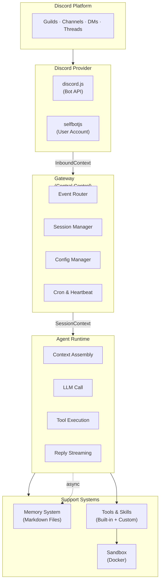

# 00 - Architecture Overview

## 1. Overview

DisClaw is a self-hosted autonomous AI agent designed specifically for Discord. Unlike OpenClaw's multi-channel approach, DisClaw focuses on a single platform with deep integration — treating Discord as its primary and only messaging interface.

DisClaw adopts OpenClaw's proven patterns (hub-and-spoke gateway, agent loop, markdown memory, skill system) but simplifies the channel layer to a single Discord provider with two connection methods.

---

## 2. Component Diagram

---

## 3. Module Map

Planned TypeScript packages for DisClaw monorepo:

| Package | Purpose |
|---------|---------|
| `@disclaw/bot` | Discord provider (discord.js, selfbotjs) — normalizes events to `InboundContext` |
| `@disclaw/gateway` | WebSocket server, event routing, session management, config handling |
| `@disclaw/agent` | Agent loop (context assembly, LLM calls, tool execution, streaming) |
| `@disclaw/memory` | Markdown-based memory system (MEMORY.md, SOUL.md, SQLite indexing) |
| `@disclaw/tools` | Built-in tools (bash, browser, file, canvas, cron, git) |
| `@disclaw/sandbox` | Docker-based execution sandbox, fail-closed policy |
| `@disclaw/types` | Shared TypeScript types (InboundContext, SessionContext, etc.) |
| `@disclaw/config` | YAML configuration loader, env var overlay |

---

## 4. Technology Stack

| Component | Technology |
|-----------|-----------|
| **Runtime** | Node.js / TypeScript |
| **Monorepo** | Turborepo + Yarn 4.13.0 |
| **Discord (Bot)** | discord.js v14+ |
| **Discord (Selfbot)** | selfbotjs (placeholder) |
| **Gateway** | WebSocket server (native) |
| **Browser** | Puppeteer / Playwright |
| **Memory Index** | SQLite + vector embeddings |
| **Sandbox** | Docker containers |
| **Config** | YAML |
| **Skills** | Markdown + YAML frontmatter |

---

## 5. System Architecture Layers

### 5.1 Provider Layer
The Discord provider abstracts two connection methods behind a unified interface (`InboundContext`). Both methods normalize Discord events into a common format for routing to the Gateway.

**Active**: discord.js (official bot API) — bot token authentication, slash commands, rich embeds, gateway intents
**Placeholder**: selfbotjs (user account automation) — reserved for future development

### 5.2 Gateway Layer
Single always-on process serving as the central control plane:
- WebSocket server on configurable port (default 18789)
- Event router (guild/channel/user-based)
- Session manager (maintains state across requests)
- Config manager (YAML + hot-reload)
- Cron scheduler + heartbeat system

### 5.3 Agent Runtime Layer
Executes the agent loop: `receive → route → context + LLM + tools → stream → persist`
1. Discord event routed by gateway
2. Agent loads context (session history + memory + skills)
3. Assembled context sent to LLM
4. Model returns tool calls → runtime executes against sandbox
5. Reply streamed back to Discord (messages, embeds, threads)
6. Conversation + memory updates persisted

### 5.4 Support Layers
**Memory**: Plain Markdown files on filesystem (MEMORY.md, SOUL.md, daily logs) with SQLite vector indexing for semantic search

**Tools & Skills**: Built-in tools (bash, browser, file, etc.) plus extensible skill system (Markdown-based with YAML frontmatter)

**Sandbox**: Docker containers for safe tool execution with fail-closed policy

---

## 6. Key Differences from OpenClaw

| Aspect | OpenClaw | DisClaw |
|--------|----------|---------|
| **Channels** | 25+ (WhatsApp, Telegram, Discord, Slack...) | Discord only |
| **Connection methods** | One adapter per platform | Two methods: discord.js + selfbotjs |
| **Session routing** | Cross-platform continuity | Guild/channel/user-based routing |
| **Deployment** | Personal single-operator | Discord-native, cloud-ready |
| **Package manager** | npm | Yarn (Turborepo monorepo) |
| **Channel abstraction** | Heavy normalization for 25+ platforms | Thin provider interface, Discord-specific features preserved |

---

## 7. Design Principles

1. **Single platform, deep integration** — By focusing on Discord only, DisClaw can leverage Discord-specific features (slash commands, embeds, threads, components, voice) without abstraction overhead.

2. **Dual provider pattern** — The provider interface abstracts bot vs selfbot, allowing future selfbot development without touching Gateway or Runtime.

3. **OpenClaw-compatible patterns** — Markdown-based memory and SKILL.md format maintained for potential skill portability.

4. **Monorepo structure** — Turborepo enables clean separation of concerns (bot, gateway, runtime, skills) while sharing types and configs.

5. **Sandbox-first for tools** — Docker sandboxing for tool execution, fail-closed policy inherited from OpenClaw.

---

## Cross-References

- [01-discord-provider.md](./01-discord-provider.md) — Discord provider layer detail
- [02-gateway.md](./02-gateway.md) — Gateway as central control plane
- [03-agent-runtime.md](./03-agent-runtime.md) — Agent loop execution
- [04-memory-system.md](./04-memory-system.md) — Markdown-based memory
- [05-tools-skills-system.md](./05-tools-skills-system.md) — Built-in tools and skills
- [06-scheduling-cron.md](./06-scheduling-cron.md) — Heartbeat and cron system
- [07-configuration.md](./07-configuration.md) — YAML configuration
- [08-security-sandbox.md](./08-security-sandbox.md) — Docker sandboxing
