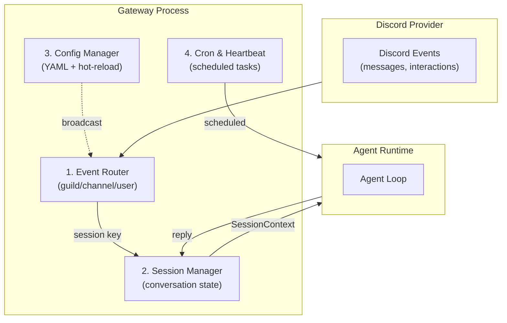
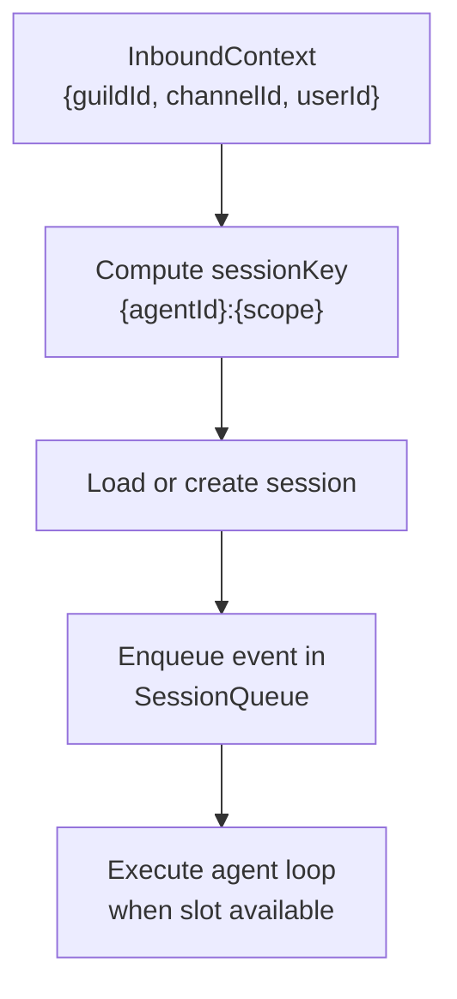
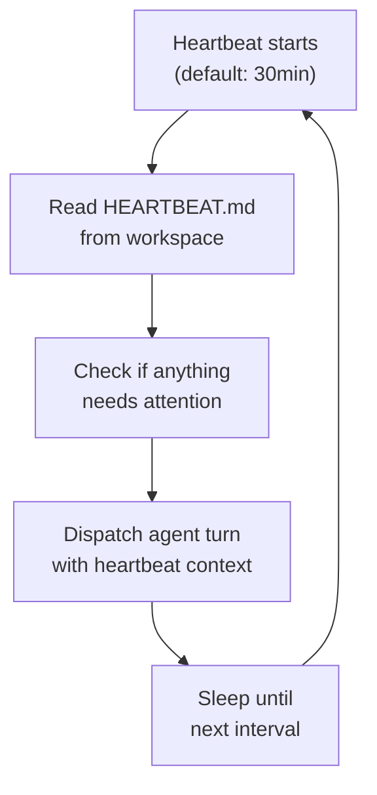
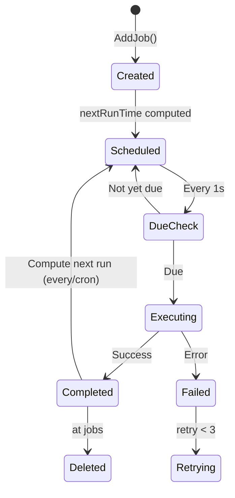
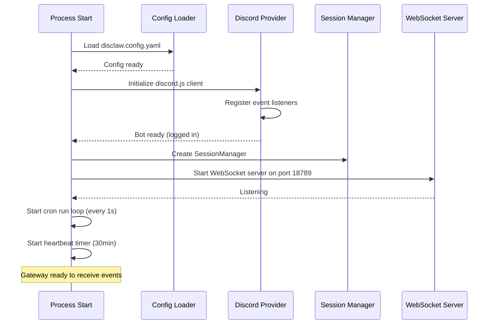

# 02 - Gateway

The Gateway is the **single always-on process** — central control plane for DisClaw. It owns the Discord provider connection, routes incoming events to sessions, dispatches agent runtime execution, and manages cron scheduling.

---

## 1. Gateway Architecture



---

## 2. Gateway Responsibilities

| Responsibility | Details |
|---|---|
| **Discord Connection** | Owns and initializes Discord provider (discord.js client) |
| **Event Routing** | Routes `InboundContext` to correct session by guild/channel/user |
| **Session Management** | Maintains conversation state, history, and metadata per session |
| **Config Management** | Loads YAML config, watches for changes, broadcasts updates |
| **Cron Scheduling** | Manages heartbeat (30min interval) and cron jobs (time-triggered agent runs) |
| **WebSocket Server** | Optional: expose RPC interface for external clients |

---

## 3. Session Routing

When an event arrives from Discord, it is routed to a session based on scope:



### Session Key Hierarchy

```
1. guild:channel:user    → {agentId}:guild:{guildId}:channel:{channelId}:user:{userId}
2. guild:channel        → {agentId}:guild:{guildId}:channel:{channelId}
3. guild:user (DM)      → {agentId}:guild:{guildId}:user:{userId}
4. guild                → {agentId}:guild:{guildId}
5. user (DM outside guild) → {agentId}:user:{userId}
```

**Priority**: Most specific scope wins. A DM in a guild context routes to guild:user scope, not user scope.

---

## 4. Session State

Each session maintains:

```typescript
interface SessionState {
  sessionKey: string;
  agentId: string;
  conversationHistory: Message[];   // entire chat history
  metadata: {
    createdAt: Date;
    lastMessageAt: Date;
    guildId?: string;
    channelId?: string;
    userId?: string;
  };
  isActive: boolean;
}
```

Sessions are persisted to allow resuming conversations after gateway restart.

---

## 5. Configuration Management

### Config File
```yaml
# disclaw.config.yaml
provider:
  method: bot
  token: ${DISCORD_BOT_TOKEN}
  intents:
    - Guilds
    - GuildMessages
    - MessageContent
    - DirectMessages
  allowlist:
    guilds: ["123456789"]
    channels: ["987654321"]
    users: ["111222333"]

agent:
  provider: anthropic
  model: claude-sonnet-4-20250514
  memorySearch:
    store:
      path: ~/.disclaw/memory/{agentId}.sqlite

gateway:
  port: 18789
  host: 127.0.0.1
  heartbeat:
    interval: 30m

sandbox:
  enabled: true
  runtime: docker
```

### Hot-Reload
- File watcher monitors `disclaw.config.yaml`
- On change, config is reloaded and broadcast to all components
- Intents, allowlist, and agent settings updated without restart

---

## 6. Heartbeat System

Periodic checks running inside the agent's main session.



The heartbeat gives the agent a chance to:
- Monitor guild activity
- Check channel updates
- Run maintenance tasks
- Update memory as needed

---

## 7. Cron Jobs

Time-based scheduled task execution.

### Lifecycle



### Schedule Types

| Type | Parameter | Example | Behavior |
|------|-----------|---------|----------|
| `at` | epoch ms | 1630000000000 | One-time, auto-deleted after execution |
| `every` | interval ms | 1800000 (30min) | Repeats at fixed interval |
| `cron` | 5-field expr | `"0 9 * * 1-5"` | Cron schedule (9AM weekdays) |

### Run Logging
Each cron run is logged with:
- Job ID
- Start/end timestamp
- Exit status (success/failure)
- Error message (if failed)
- Retry count

---

## 8. Gateway Startup Sequence



---

## 9. Graceful Shutdown

On SIGINT or SIGTERM:

1. Stop accepting new Discord events
2. Flush pending agent runs (wait up to timeout)
3. Stop cron scheduler
4. Close WebSocket connections
5. Save session state to disk
6. Exit

---

## 10. File Reference

**Planned files** (not yet implemented):

| File | Purpose |
|------|---------|
| `packages/gateway/gateway.ts` | Main Gateway class, startup orchestration |
| `packages/gateway/event-router.ts` | Routes InboundContext to sessions by scope |
| `packages/gateway/session-manager.ts` | Session state management, persistence |
| `packages/gateway/config-manager.ts` | Config loading, hot-reload, broadcast |
| `packages/gateway/cron-scheduler.ts` | Cron job management, run loop |
| `packages/gateway/heartbeat.ts` | Heartbeat timer and execution |
| `packages/gateway/ws-server.ts` | Optional: WebSocket RPC server for external clients |

---

## Cross-References

- [00-architecture-overview.md](./00-architecture-overview.md) — System architecture diagram
- [01-discord-provider.md](./01-discord-provider.md) — Discord provider layer
- [03-agent-runtime.md](./03-agent-runtime.md) — Agent loop triggered by gateway
- [06-scheduling-cron.md](./06-scheduling-cron.md) — Detailed cron and heartbeat system
- [07-configuration.md](./07-configuration.md) — Full configuration reference
