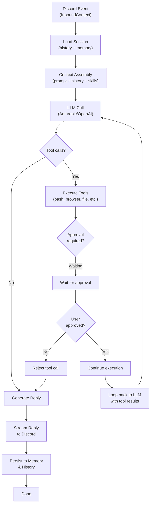
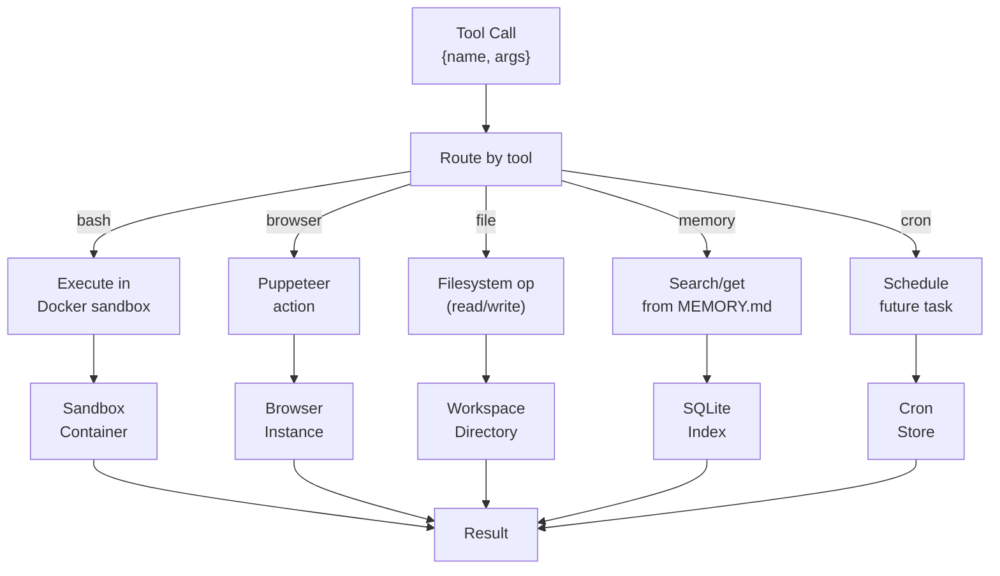

# 03 - Agent Runtime

The runtime executes the agent loop — the core reasoning cycle that receives Discord events, assembles context, calls the LLM, executes tools, and streams responses back.

---

## 1. Agent Loop Flow



---

## 2. Step-by-Step Execution

### Step 1: Load Session
```typescript
sessionKey = "{agentId}:guild:{guildId}:channel:{channelId}:user:{userId}"
session = sessionManager.get(sessionKey)
history = session.conversationHistory  // all prior messages in this session
```

### Step 2: Assemble Context
```
Context = {
  systemPrompt: from SOUL.md,
  agentInstructions: from AGENTS.md,
  conversationHistory: [
    {role: "user", content: "previous messages"},
    {role: "assistant", content: "previous responses"}
  ],
  recentMemory: from memory_search tool (today + yesterday),
  skills: available tools and skill instructions,
  timestamp: now,
}
```

### Step 3: LLM Call
```typescript
response = await lmProvider.chat({
  model: config.agent.model,
  context: assembledContext,
  tools: toolRegistry.list(),
  streaming: true,
});
```

### Step 4: Handle Tool Calls
If LLM requests tool execution:
```typescript
for (const toolCall of response.toolCalls) {
  if (requiresApproval(toolCall)) {
    // Wait for user approval via exec.approval RPC
    approved = await waitForApproval(toolCall.id);
    if (!approved) continue;
  }

  result = await executeToolInSandbox(toolCall);
  // Continue loop with tool result
}
```

### Step 5: Stream Reply
```typescript
for (const chunk of response.contentChunks) {
  await discordProvider.sendChunk({
    channelId: event.channelId,
    threadId: event.messageId,
    content: chunk,
  });
}
```

### Step 6: Persist
```typescript
session.conversationHistory.push({
  role: "user",
  content: event.content,
});
session.conversationHistory.push({
  role: "assistant",
  content: response.finalContent,
});
await memorySystem.flush(session);  // update MEMORY.md, daily log
await sessionManager.save(session);
```

---

## 3. Context Assembly

The context assembler builds the full context sent to the LLM.

```typescript
interface AssembledContext {
  systemPrompt: string;           // from SOUL.md
  agentInstructions: string;      // from AGENTS.md
  conversationHistory: Message[]; // all messages in session
  recentMemory: string;           // today + yesterday from daily logs
  toolInstructions: string;       // skill instructions + tool definitions
  metadata: {
    timestamp: Date;
    sessionKey: string;
    agentId: string;
    userId: string;
  };
}
```

### Memory Layers

| Layer | Source | Loaded When | Purpose |
|-------|--------|-------------|---------|
| **Soul** | SOUL.md | Always | Immutable operating instructions |
| **Agents** | AGENTS.md | Always | Agent configuration + special behaviors |
| **Long-term** | MEMORY.md | Main session only | Curated facts, preferences, decisions |
| **Daily log** | memory/YYYY-MM-DD.md | Session start | Today + yesterday context |

---

## 4. LLM Provider Interface

The runtime is agnostic to the LLM provider. Two implementations are planned:

### Anthropic (Primary)
```typescript
interface AnthropicProvider {
  chat(request: ChatRequest): Promise<ChatResponse>;
  chatStream(request: ChatRequest): AsyncIterator<StreamChunk>;
  name(): string;
  defaultModel(): string;
}
```

**Supported features**: Tool use, streaming, extended thinking (budget tokens)

### OpenAI-Compatible (Future)
Works with OpenAI, Gemini, DeepSeek, and other `/chat/completions`-compatible APIs.

---

## 5. Tool Execution

The tool executor runs in an isolated sandbox.



### Built-in Tools

| Tool | Execution | Approval Required |
|------|-----------|-------------------|
| `bash` | Docker sandbox (isolated) | Yes (dangerous) |
| `browser` | Puppeteer/Playwright | No |
| `file` | Local workspace directory | No |
| `memory_search` | SQLite vector search | No |
| `memory_get` | Direct file read | No |
| `canvas` | Image generation | No |
| `cron` | Cron store persistence | No |
| `git` | Host git repo (isolated) | Yes |

---

## 6. Streaming

Responses are streamed back to Discord as they are generated.

```typescript
// Stream response chunks as they arrive from LLM
for await (const chunk of lmProvider.chatStream(context)) {
  // Accumulate tokens
  buffer += chunk.content;

  // Every N tokens or after timeout, send to Discord
  if (buffer.length > 500 || timeSinceLastSend > 2000) {
    await discordProvider.updateMessage({
      channelId: event.channelId,
      messageId: currentMessageId,
      content: buffer,
    });
  }
}

// Send final message
await discordProvider.sendMessage({
  channelId: event.channelId,
  threadId: event.messageId,
  content: buffer,
  embeds: finalEmbeds,
});
```

---

## 7. Session Context

Each agent execution receives a `SessionContext` containing session state and callbacks.

```typescript
interface SessionContext {
  sessionKey: string;
  agentId: string;
  userId: string;
  guildId?: string;
  channelId?: string;
  messageId: string;

  // State
  history: Message[];
  memory: {
    search(query: string): Promise<string[]>;
    get(filename: string): Promise<string>;
  };

  // Callbacks
  onToolCall(toolCall: ToolCall): Promise<ToolResult>;
  onReply(content: string): Promise<void>;
  onApprovalRequired(toolCall: ToolCall): Promise<boolean>;
}
```

---

## 8. Error Handling

Errors are caught and returned to the user gracefully.

```typescript
try {
  response = await runAgent(sessionContext);
} catch (error) {
  if (error instanceof LLMError) {
    reply = `LLM call failed: ${error.message}`;
  } else if (error instanceof ToolError) {
    reply = `Tool execution failed: ${error.message}`;
  } else if (error instanceof SandboxError) {
    reply = `Sandbox error: ${error.message}`;
  } else {
    reply = `Internal error: ${error.message}`;
  }

  await discordProvider.sendMessage({
    channelId: event.channelId,
    content: reply,
  });
}
```

---

## 9. File Reference

**Planned files** (not yet implemented):

| File | Purpose |
|------|---------|
| `packages/agent/agent-loop.ts` | Main agent loop orchestrator |
| `packages/agent/context-assembler.ts` | Assemble context from history + memory + skills |
| `packages/agent/tool-executor.ts` | Execute tool calls, handle approvals |
| `packages/agent/stream-handler.ts` | Stream response chunks to Discord |
| `packages/agent/error-handler.ts` | Error handling and user feedback |
| `packages/agent/session-context.ts` | SessionContext interface and implementation |

---

## Cross-References

- [00-architecture-overview.md](./00-architecture-overview.md) — Architecture overview
- [04-memory-system.md](./04-memory-system.md) — Memory system and context loading
- [05-tools-skills-system.md](./05-tools-skills-system.md) — Tool definitions and skill system
- [08-security-sandbox.md](./08-security-sandbox.md) — Sandbox execution and fail-closed policy
