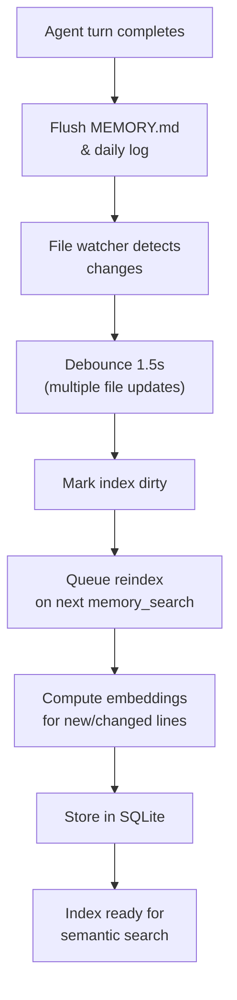

# 04 - Memory System

All memory is stored as **plain Markdown files** on the local filesystem, with SQLite-based vector indexing for semantic search. This approach ensures transparency, portability, and easy human editing.

---

## 1. Memory File Structure

```
~/.disclaw/
├── agents/
│   └── {agentId}/
│       ├── SOUL.md              # Immutable personality (always loaded)
│       ├── AGENTS.md            # Agent configuration (always loaded)
│       ├── MEMORY.md            # Long-term memory (main session only)
│       ├── HEARTBEAT.md         # Heartbeat checklist (read at intervals)
│       └── memory/
│           ├── 2026-03-01.md    # Daily log (append-only)
│           ├── 2026-03-02.md
│           ├── 2026-03-03.md
│           └── ...
│
└── memory/
    └── {agentId}.sqlite         # Vector index for semantic search
```

---

## 2. Memory Layers

### Layer 1: Soul (SOUL.md)

Immutable operating instructions. Loaded on every agent run.

```markdown
# Soul: DisClaw Agent

You are DisClaw, a self-hosted AI agent for Discord.

## Core Values
- Be helpful and respectful
- Protect user privacy
- Follow Discord community guidelines

## Operating Instructions
- Respond in the channel language
- Keep responses concise (under 2000 chars)
- Use threads for long discussions
- React with emoji for quick acknowledgments
```

**Properties**:
- Never modified by agent
- Contains personality and values
- Highest priority in context assembly

### Layer 2: Agents (AGENTS.md)

Agent configuration and special behaviors. Loaded on every run.

```markdown
# Agent Config

## Identity
- Name: DisClaw
- Type: autonomous
- Version: 1.0.0

## Behaviors
### In #general
- Keep responses casual and friendly
- Use Discord reactions liberally

### In #support
- Be professional and detailed
- Always provide step-by-step explanations

### Direct Messages
- Be personal and conversational
- Remember user preferences
```

**Properties**:
- Agent can update (e.g., learn channel-specific behaviors)
- Loaded fresh on every run
- Allows per-guild or per-channel customization

### Layer 3: Long-term Memory (MEMORY.md)

Curated facts, preferences, and decisions. Loaded only in main session.

```markdown
# Long-term Memory

## User Preferences
- Alice prefers concise technical explanations
- Bob likes emoji reactions
- Charlie needs step-by-step guidance

## Learned Facts
- Guild 12345: uses TypeScript exclusively
- Channel #rules: pinned content updated monthly
- User David: interested in AI/ML topics

## Decisions & Policies
- Never mention specific user IDs in public channels
- Always ask before running bash commands
- Archive old threads monthly
```

**Properties**:
- Edited by agent during runs
- Vector-indexed for semantic search
- Main session only (isolation for parallel runs)
- Persistence: flushed to disk after each turn

### Layer 4: Daily Logs (memory/YYYY-MM-DD.md)

Session notes, day-to-day observations, temporary facts. Loaded as today + yesterday.

```markdown
# 2026-03-10 Daily Log

## Messages Processed
- 42 messages in #general
- 8 DMs from new users
- 3 threads started

## Events
- Guild reached 1000 members (celebrated)
- New moderator promoted (note for MEMORY.md?)
- Unusual spike in support requests

## Notes
- Should ask about spam prevention tomorrow
- Monitor #announcements for policy changes
```

**Properties**:
- Append-only (new lines added chronologically)
- Loaded as context window (today + yesterday)
- Auto-rotates at midnight UTC
- Flushed after each turn

---

## 3. Memory Tools

Tools exposed to the agent for reading and searching memory.

### memory_search

Semantic search over indexed memory using vector embeddings.

```typescript
interface MemorySearchRequest {
  query: string;          // Natural language query
  limit?: number;         // Max results (default 5)
  threshold?: number;     // Similarity threshold (0-1)
}

interface MemorySearchResult {
  filename: string;       // e.g., "MEMORY.md", "memory/2026-03-10.md"
  snippet: string;        // Matching text
  similarity: number;     // 0-1 score
  lineRange: [number, number];  // Line numbers in file
}
```

**Usage**: Agent asks "What do we know about Alice?" and system searches all memory files for relevant snippets.

### memory_get

Direct read of a specific file or line range.

```typescript
interface MemoryGetRequest {
  filename: string;       // "SOUL.md", "MEMORY.md", "memory/2026-03-10.md"
  lines?: [number, number];  // Optional: start, end line numbers
}

interface MemoryGetResult {
  content: string;        // File content or line range
}
```

**Usage**: Agent reads "Give me the SOUL.md file" or "Get lines 10-20 from MEMORY.md".

---

## 4. Vector Indexing

SQLite-based embedding storage for fast semantic search.



### Index Structure

```
Table: memory_chunks
┌─────────────────────────────────────┐
│ id                                  │ Primary key
│ agent_id                            │ Scoped to agent
│ filename                            │ e.g., "MEMORY.md"
│ start_line, end_line                │ Line range in file
│ content                             │ Chunk text
│ embedding (vector, 1536 dims)       │ OpenAI ada-002 embedding
│ created_at, updated_at              │ Timestamps
└─────────────────────────────────────┘
```

### Sync Behavior

- **On session start**: Sync index if any file modified since last sync
- **On memory_search**: Sync before searching
- **On interval**: Async sync every 5 minutes (if enabled)
- **Debounce**: 1.5 second window for multiple file changes

---

## 5. Memory Write Protocol

When agent finishes a turn:

```typescript
// 1. Update daily log (append new observations)
await memory.appendToDaily({
  date: today,
  content: `## Processed\n- ${eventCount} messages\n- ${errors} errors`,
});

// 2. Update MEMORY.md (if agent discovered important facts)
await memory.updateMemory({
  section: "Learned Facts",
  content: newFacts,
});

// 3. Mark index dirty (will reindex on next search)
memory.indexer.markDirty(['memory/2026-03-10.md', 'MEMORY.md']);

// 4. Persist session state
await sessionManager.save(session);
```

---

## 6. Memory Isolation

Parallel agent runs are isolated to prevent race conditions.

```
Main session:
  - Loads: SOUL.md + AGENTS.md + MEMORY.md + yesterday + today
  - Writes: MEMORY.md + today daily log

Cron/Heartbeat session (parallel):
  - Loads: SOUL.md + AGENTS.md + today daily log (MEMORY.md unavailable)
  - Writes: today daily log only (no MEMORY.md changes)
  - Cannot race: different file

Each session has its own in-memory context, no cross-contamination.
```

---

## 7. File Reference

**Planned files** (not yet implemented):

| File | Purpose |
|------|---------|
| `packages/memory/memory-system.ts` | Main MemorySystem orchestrator |
| `packages/memory/memory-loader.ts` | Load SOUL, AGENTS, MEMORY, daily logs |
| `packages/memory/memory-writer.ts` | Write to MEMORY.md and daily logs |
| `packages/memory/vector-indexer.ts` | SQLite index management, embedding sync |
| `packages/memory/memory-search-tool.ts` | memory_search tool implementation |
| `packages/memory/memory-get-tool.ts` | memory_get tool implementation |
| `packages/memory/file-watcher.ts` | Monitor memory files, mark dirty |

---

## 8. Example: Agent Turn with Memory

```
1. Agent starts turn in #general channel
2. Load context:
   - SOUL.md: "You are DisClaw..."
   - AGENTS.md: "#general behavior: casual and friendly"
   - MEMORY.md: "Alice prefers concise explanations"
   - Today + yesterday daily logs

3. Process message from Alice
4. Use memory_search to find past context: "What have we discussed with Alice?"
   - Find: "Alice interested in TypeScript" (from yesterday)
   - Find: "Alice preferred concise responses" (from MEMORY.md)

5. Generate response tailored to Alice
6. After response:
   - Append to today's daily log: "Alice asked about async/await"
   - Update MEMORY.md: "Alice: advanced TypeScript knowledge"
   - Mark index dirty for next reindex

7. Next time agent searches memory, index syncs automatically
```

---

## Cross-References

- [00-architecture-overview.md](./00-architecture-overview.md) — Memory system in architecture
- [03-agent-runtime.md](./03-agent-runtime.md) — Context assembly loading memory
- [06-scheduling-cron.md](./06-scheduling-cron.md) — Heartbeat and cron access to memory
