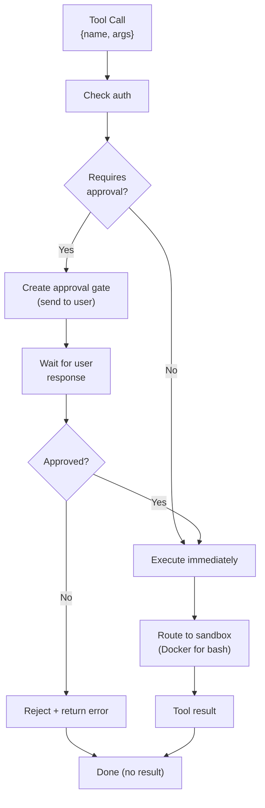
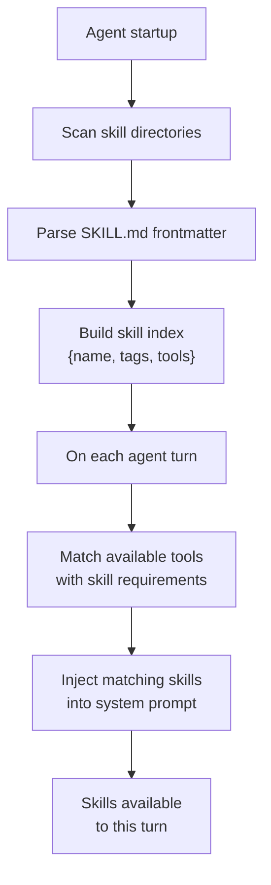

# 05 - Tools & Skills System

DisClaw provides built-in tools for common operations plus an extensible skill system inspired by OpenClaw. Skills are Markdown files with YAML frontmatter that encapsulate knowledge and instructions.

---

## 1. Built-in Tools

Core tools available to every agent turn.

### bash

Execute shell commands in an isolated Docker sandbox.

```typescript
interface BashRequest {
  command: string;        // Shell command to execute
  cwd?: string;           // Working directory (default: ~/.disclaw/workspace)
  timeout?: number;       // Max execution time (ms, default 30000)
  host?: 'sandbox' | 'host';  // Execution environment (default: sandbox)
}

interface BashResult {
  exitCode: number;
  stdout: string;
  stderr: string;
  duration: number;       // ms
}
```

**Approval**: Yes (dangerous) — requires user approval

**Sandbox behavior**: Fails closed if sandbox unavailable (no fallback to host)

### browser

Puppeteer/Playwright automation for web scraping and interaction.

```typescript
interface BrowserRequest {
  action: 'navigate' | 'click' | 'type' | 'screenshot' | 'extract';
  url?: string;           // For navigate
  selector?: string;      // For click/type
  text?: string;          // For type
  timeout?: number;       // Default 30000ms
}

interface BrowserResult {
  success: boolean;
  screenshot?: string;    // Base64 image
  html?: string;          // DOM snapshot
  data?: any;             // Extracted data
}
```

**Approval**: No

### file

Read, write, and search files in workspace directory.

```typescript
interface FileRequest {
  action: 'read' | 'write' | 'search' | 'list';
  path: string;           // Relative to ~/workspace
  content?: string;       // For write
  query?: string;         // For search (regex)
}

interface FileResult {
  content?: string;
  matches?: {path: string, lines: string[]}[];
  files?: string[];
  error?: string;
}
```

**Approval**: No — restricted to workspace directory

**Constraints**: Cannot read/write outside workspace; no symlink traversal

### memory_search

Semantic search over indexed memory files.

```typescript
interface MemorySearchRequest {
  query: string;
  limit?: number;         // Default 5
  threshold?: number;     // Similarity 0-1
}

interface MemorySearchResult {
  results: {
    filename: string;
    snippet: string;
    similarity: number;
  }[];
}
```

**Approval**: No

### memory_get

Direct read of memory file or line range.

```typescript
interface MemoryGetRequest {
  filename: string;       // SOUL.md, MEMORY.md, memory/YYYY-MM-DD.md
  lines?: [number, number];  // Optional line range
}

interface MemoryGetResult {
  content: string;
}
```

**Approval**: No

### canvas

Image and document generation.

```typescript
interface CanvasRequest {
  action: 'image' | 'chart' | 'pdf';
  prompt?: string;        // Image generation prompt
  data?: any;             // For charts
  format?: 'png' | 'jpg' | 'pdf';
}

interface CanvasResult {
  url: string;            // Local file URL
  mimeType: string;
}
```

**Approval**: No

### cron

Schedule future agent tasks.

```typescript
interface CronRequest {
  action: 'schedule' | 'list' | 'cancel';
  type?: 'at' | 'every' | 'cron';  // For schedule
  time?: number;          // Epoch ms (for 'at')
  interval?: number;      // ms (for 'every')
  expression?: string;    // Cron expr (for 'cron')
  channelId?: string;     // Where to post result
}

interface CronResult {
  jobId: string;
  nextRun?: Date;
  jobs?: CronJob[];
}
```

**Approval**: No

### git

Version control operations.

```typescript
interface GitRequest {
  action: 'clone' | 'commit' | 'push' | 'pull' | 'status';
  repo?: string;          // For clone
  message?: string;       // For commit
  files?: string[];       // Files to stage
}

interface GitResult {
  success: boolean;
  output: string;
  error?: string;
}
```

**Approval**: Yes (for push/dangerous operations)

---

## 2. Tool Execution Model

All tool execution flows through the sandbox with approval gates.



---

## 3. Skill Architecture

Skills are Markdown documents with YAML frontmatter that teach the agent how to accomplish specific tasks.

### Skill File Structure

```markdown
---
name: web-research
version: 1.0.0
description: Research topics using web search and browser
tags: [research, web, automation]
tools: [browser, file]
requires:
  - memory_search
---

# Web Research Skill

## Overview
Use this skill to research any topic by combining:
- Browser automation for web navigation
- File operations for saving results
- Memory system for persistence

## Workflow

### Step 1: Initial Search
Use the browser tool to navigate to a search engine and query for the topic.

```
browser.navigate("https://google.com")
browser.type('input[name="q"]', query)
browser.click('button[type="submit"]')
```

### Step 2: Analyze Results
Extract links and summaries from the search results page.

```
results = browser.extract('div.result')
```

### Step 3: Deep Dive
For top 3 results, navigate and extract full content.

### Step 4: Save to Memory
Update MEMORY.md with findings.

memory_search("similar research") to check for duplicates
```

## Success Criteria
- Found at least 3 relevant sources
- Extracted key facts
- Saved summary to memory
```

### YAML Frontmatter Fields

| Field | Type | Purpose |
|-------|------|---------|
| `name` | string | Unique skill identifier (kebab-case) |
| `version` | string | SemVer |
| `description` | string | One-line summary |
| `tags` | string[] | Categories (research, automation, productivity, etc.) |
| `tools` | string[] | Required tools (bash, browser, file, etc.) |
| `requires` | string[] | Required skills or features |
| `confidence` | number | 0-1 (how reliable the skill is) |

---

## 4. Skill Precedence Hierarchy

When multiple skills exist with the same name, this hierarchy determines which is loaded:

1. **Workspace skills** (`~/.disclaw/agents/{agentId}/skills/`)
   - Project-specific, highest priority
   - Can override bundled skills

2. **User-managed skills** (`~/.disclaw/skills/`)
   - User's custom skills
   - Shared across agents

3. **Bundled skills** (shipped with DisClaw)
   - Default included skills
   - Lowest priority

**Search flow**:
```
Agent needs skill "web-research"
├─ Check workspace: ~/.disclaw/agents/{agentId}/skills/web-research/SKILL.md
├─ Check user: ~/.disclaw/skills/web-research/SKILL.md
└─ Check bundled: <package>/bundled-skills/web-research/SKILL.md
```

---

## 5. Skill Discovery and Injection

Skills are discovered at startup and injected into agent context.



---

## 6. Custom Skill Example

```markdown
---
name: daily-summary
version: 1.0.0
description: Generate daily summary of guild activity
tags: [automation, reporting, daily]
tools: [file, memory_search]
requires: []
---

# Daily Summary Skill

## Purpose
Generate a daily summary of all guild activity for the team.

## When to Use
- Every morning (called by heartbeat)
- When asked directly

## Instructions

### Collect Data
1. Use memory_search("messages processed today") to find message counts
2. Search for errors or issues: memory_search("error")
3. Check for new members: memory_search("joined")

### Format Report
Create a structured markdown report:

```
# Daily Summary: 2026-03-10

## Highlights
- {count} messages processed
- {count} new members
- {count} support tickets

## Metrics
...

## Recommendations
...
```

### Save
Write report to ~/workspace/reports/daily/2026-03-10.md
```

---

## 7. Tool Registry

The runtime maintains a registry of all available tools and skills.

```typescript
interface ToolRegistry {
  tools: Map<string, ToolDefinition>;
  skills: Map<string, SkillDefinition>;

  getTool(name: string): ToolDefinition | null;
  getSkill(name: string): SkillDefinition | null;
  getSkillsByTag(tag: string): SkillDefinition[];
  canExecute(toolName: string, agentId: string): boolean;
}

interface ToolDefinition {
  name: string;
  description: string;
  inputSchema: JSONSchema;
  requiresApproval: boolean;
}

interface SkillDefinition {
  name: string;
  version: string;
  description: string;
  tags: string[];
  tools: string[];
  content: string;  // Full SKILL.md content
}
```

---

## 8. File Reference

**Planned files** (not yet implemented):

| File | Purpose |
|------|---------|
| `packages/tools/tool-registry.ts` | Tool and skill registry management |
| `packages/tools/bash-tool.ts` | bash tool implementation |
| `packages/tools/browser-tool.ts` | browser tool implementation |
| `packages/tools/file-tool.ts` | file tool implementation |
| `packages/tools/memory-tools.ts` | memory_search and memory_get tools |
| `packages/tools/cron-tool.ts` | cron tool implementation |
| `packages/tools/git-tool.ts` | git tool implementation |
| `packages/skills/skill-loader.ts` | Load and parse SKILL.md files |
| `packages/skills/skill-injector.ts` | Inject skills into agent context |

---

## Cross-References

- [00-architecture-overview.md](./00-architecture-overview.md) — Tools in system architecture
- [03-agent-runtime.md](./03-agent-runtime.md) — Tool execution in agent loop
- [04-memory-system.md](./04-memory-system.md) — Memory tools detail
- [06-scheduling-cron.md](./06-scheduling-cron.md) — Cron tool for scheduling
- [08-security-sandbox.md](./08-security-sandbox.md) — Sandbox execution model
