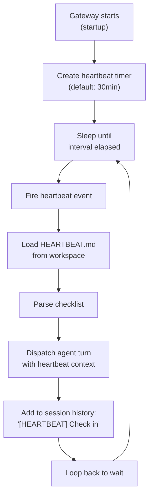
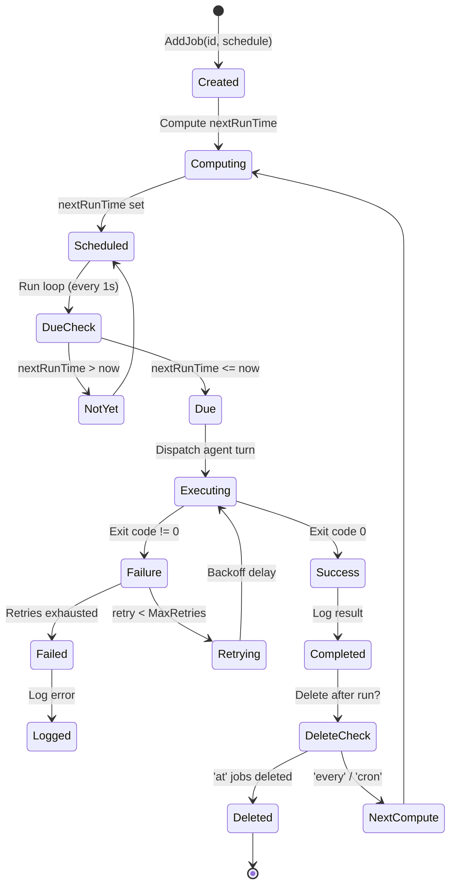
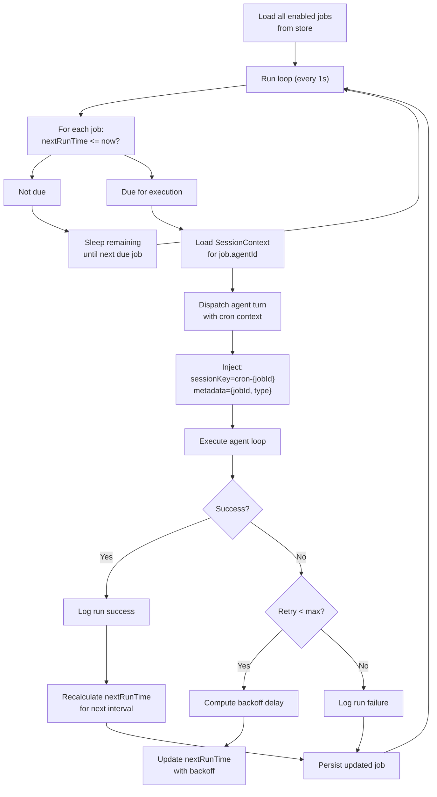

# 06 - Scheduling & Cron

Automation of periodic tasks through heartbeat (30-minute checks) and cron jobs (time-based scheduling). Both run agent turns with predefined context.

---

## 1. Heartbeat System

Periodic health checks running inside the agent's main session.

### Heartbeat Flow



### HEARTBEAT.md Format

```markdown
# Heartbeat Checklist

## Every Heartbeat
- [ ] Count messages since last check
- [ ] Check for errors in logs
- [ ] Review pending approvals

## Weekly (Monday)
- [ ] Archive old threads
- [ ] Generate weekly summary
- [ ] Check moderation queue

## Monthly (1st)
- [ ] Full guild audit
- [ ] Update MEMORY.md with new facts
- [ ] Review and clean archived channels
```

The agent reads this checklist on each heartbeat and decides what actions to take.

### Configuration

```yaml
gateway:
  heartbeat:
    interval: 30m          # 30 minutes
    enabled: true
```

Can be disabled or adjusted via config.

---

## 2. Cron Jobs

Time-based scheduled task execution with three schedule types.

### Cron Job Lifecycle



### Schedule Types

| Type | Parameter | Example | Behavior |
|------|-----------|---------|----------|
| `at` | Epoch ms | `1630000000000` | One-time execution, auto-deleted after run |
| `every` | Interval ms | `1800000` (30 min) | Repeats at fixed interval |
| `cron` | 5-field expr | `"0 9 * * 1-5"` (9 AM weekdays) | Unix cron schedule |

### Cron Expression Format

Standard 5-field cron syntax:

```
┌───────────── minute (0 - 59)
│ ┌───────────── hour (0 - 23)
│ │ ┌───────────── day of month (1 - 31)
│ │ │ ┌───────────── month (1 - 12)
│ │ │ │ ┌───────────── day of week (0 - 6) (Sunday to Saturday)
│ │ │ │ │
│ │ │ │ │
* * * * *

Examples:
0 9 * * 1-5      → 9 AM on weekdays
30 3 * * *       → 3:30 AM daily
0 0 1 * *        → Midnight on 1st of month
*/15 * * * *     → Every 15 minutes
```

---

## 3. Job Configuration

### Creating a Cron Job

```typescript
// Via cron.create RPC method
{
  id: "daily-summary",
  name: "Daily Summary Report",
  type: "cron",
  expression: "0 9 * * *",              // 9 AM daily
  agentId: "main",
  channelId: "987654321",               // Where to post results
  enabled: true,
  maxRetries: 3,
  retryBackoffMs: 2000,
  tags: ["daily", "reporting"]
}

// Via cron.create RPC (at job)
{
  id: "reminder-tomorrow",
  type: "at",
  atMs: 1630000000000,                  // Specific timestamp
  agentId: "main",
  channelId: "123456789",
  enabled: true,
  deleteAfterRun: true
}

// Via cron.create RPC (every)
{
  id: "background-check",
  type: "every",
  everyMs: 300000,                      // Every 5 minutes
  agentId: "main",
  enabled: true
}
```

---

## 4. Retry Logic

Failed cron jobs retry with exponential backoff.

### Retry Configuration

| Parameter | Default | Description |
|-----------|---------|-------------|
| `MaxRetries` | 3 | Total retry attempts |
| `BaseDelay` | 2 seconds | Initial delay |
| `MaxDelay` | 30 seconds | Upper delay cap |
| `Jitter` | 25% | Random variation |

### Backoff Formula

```
delay = min(baseDelay × 2^(attempt - 1), maxDelay)
delay += (-jitterPercent, +jitterPercent) × delay

Example:
Attempt 1: 2s ± 0.5s    → 1.5s - 2.5s
Attempt 2: 4s ± 1s      → 3s - 5s
Attempt 3: 8s ± 2s      → 6s - 10s
```

If last retry fails, the job is logged as failed and not rescheduled.

---

## 5. Job State Management

Jobs persist in a cron store (future: SQLite or file-based).

### Job States

```typescript
interface CronJob {
  id: string;
  name: string;
  agentId: string;
  type: 'at' | 'every' | 'cron';

  // Schedule
  atMs?: number;
  everyMs?: number;
  expression?: string;
  nextRunTime?: Date;
  lastRunTime?: Date;

  // Execution
  enabled: boolean;
  maxRetries: number;
  retryCount: number;

  // Output
  channelId?: string;        // Where to post results

  // Metadata
  createdAt: Date;
  updatedAt: Date;
  deletedAt?: Date;          // Soft-delete
}

interface CronRunLog {
  jobId: string;
  runTime: Date;
  duration: number;          // ms
  exitCode: number;
  output: string;            // Command output
  error?: string;
  retryAttempt: number;
}
```

---

## 6. Cron Run Loop

The cron service runs continuously, checking for due jobs every second.



---

## 7. Job Isolation

Cron jobs run in isolated sessions to prevent memory interference.

```
Main session:
  - sessionKey: "{agentId}:guild:{guildId}:channel:{channelId}:user:{userId}"
  - Can access: SOUL.md + AGENTS.md + MEMORY.md + today + yesterday logs
  - Can write: MEMORY.md, today daily log

Cron job session:
  - sessionKey: "cron-{jobId}"
  - Can access: SOUL.md + AGENTS.md + today daily log (MEMORY.md unavailable)
  - Can write: today daily log only (no MEMORY.md changes)
  - Benefit: No race conditions with main session
```

---

## 8. Job Output

Cron job results are sent to a designated Discord channel.

```typescript
if (job.channelId) {
  // Send result message to channel
  await discordProvider.sendMessage({
    channelId: job.channelId,
    content: `**[Cron: ${job.name}]**\n${output}`,
    embeds: [{
      title: "Job Complete",
      fields: [
        {name: "Job ID", value: job.id},
        {name: "Duration", value: `${duration}ms`},
        {name: "Exit Code", value: `${exitCode}`}
      ]
    }]
  });
}
```

---

## 9. Cron Tool

Agents can create and manage cron jobs using the `cron` tool.

```typescript
interface CronToolRequest {
  action: 'schedule' | 'list' | 'cancel' | 'enable' | 'disable';

  // For schedule
  id?: string;
  type?: 'at' | 'every' | 'cron';
  atMs?: number;
  everyMs?: number;
  expression?: string;
  channelId?: string;
}

interface CronToolResult {
  success: boolean;
  jobId?: string;
  jobs?: CronJob[];
  error?: string;
}
```

**Example**: Agent can call `cron.schedule("0 9 * * *", "daily-summary", "#reports")` to schedule itself to run daily at 9 AM.

---

## 10. File Reference

**Planned files** (not yet implemented):

| File | Purpose |
|------|---------|
| `packages/gateway/heartbeat.ts` | Heartbeat timer, HEARTBEAT.md reading |
| `packages/gateway/cron-scheduler.ts` | Cron run loop, job execution |
| `packages/gateway/cron-store.ts` | Job persistence (jobs + run logs) |
| `packages/gateway/cron-retry.ts` | Retry logic with exponential backoff |
| `packages/tools/cron-tool.ts` | cron tool for agents |

---

## Cross-References

- [02-gateway.md](./02-gateway.md) — Gateway owns cron scheduling
- [03-agent-runtime.md](./03-agent-runtime.md) — Agent loop triggered by cron
- [04-memory-system.md](./04-memory-system.md) — Memory isolation in cron sessions
- [05-tools-skills-system.md](./05-tools-skills-system.md) — cron tool definition
