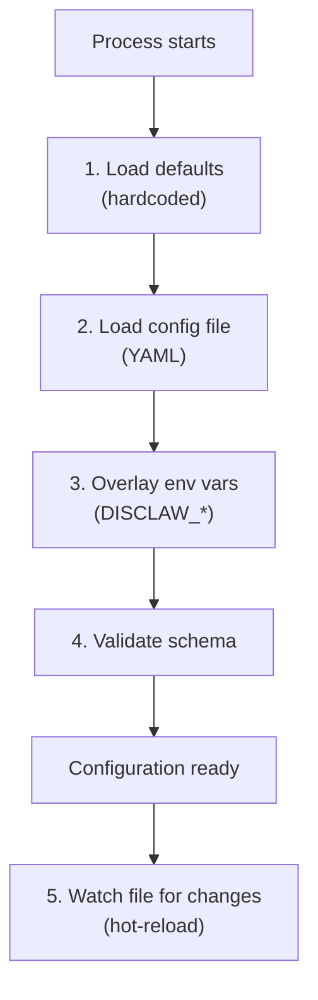
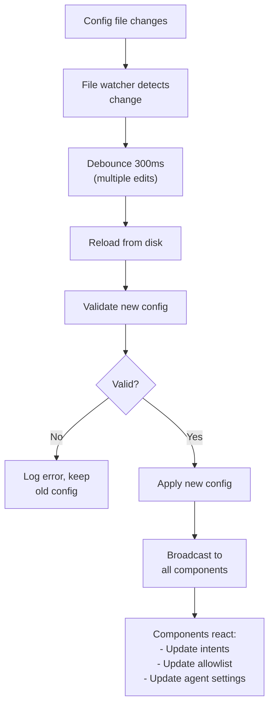

# 07 - Configuration

DisClaw configuration is YAML-based with environment variable overlay. Secrets are managed separately from config files, and hot-reload allows updates without restarting.

---

## 1. Configuration File

### Location

```
$HOME/.disclaw/disclaw.config.yaml
```

Or specified via environment variable:

```bash
export DISCLAW_CONFIG=/path/to/config.yaml
disclaw --config /path/to/config.yaml
```

---

## 2. Complete Configuration Reference

```yaml
# disclaw.config.yaml

# ===========================
# Discord Provider
# ===========================
provider:
  # Connection method: 'bot' (discord.js) or 'selfbot' (placeholder)
  method: bot

  # Bot token (via env var, never in file)
  token: ${DISCORD_BOT_TOKEN}

  # Gateway intents (selective event subscription)
  intents:
    - Guilds
    - GuildMessages
    - MessageContent
    - DirectMessages
    # Optional intents:
    # - GuildMembers          # Member join/leave
    # - GuildVoiceStates      # Voice channel changes
    # - MessageReactions      # Emoji reactions
    # - GuildPresences        # User online status

  # Allowlist (restrict which guilds/channels/users are processed)
  allowlist:
    # Required: list of guild IDs to accept messages from
    guilds:
      - "123456789"
      - "987654321"

    # Optional: if present, only these channels are processed
    channels:
      - "111111111"
      - "222222222"

    # Optional: if present, only these users trigger agent
    users:
      - "333333333"
      - "444444444"

# ===========================
# Agent Configuration
# ===========================
agent:
  # LLM provider: 'anthropic' (primary) or 'openai-compatible'
  provider: anthropic

  # Model name (depends on provider)
  model: claude-sonnet-4-20250514

  # Context window size (tokens)
  contextWindow: 200000

  # Temperature (0-2, higher = more creative)
  temperature: 0.7

  # Max tokens in a single response
  maxTokens: 4096

  # Memory search configuration
  memorySearch:
    # Vector embedding provider (future: anthropic, openai)
    embedder: anthropic

    # Vector store
    store:
      type: sqlite
      path: ~/.disclaw/memory/{agentId}.sqlite

    # Semantic search threshold (0-1)
    similarityThreshold: 0.7

    # Max results per search
    limit: 5

# ===========================
# Gateway Configuration
# ===========================
gateway:
  # WebSocket server binding
  port: 18789
  host: 127.0.0.1

  # Heartbeat system
  heartbeat:
    enabled: true
    interval: 30m

  # Session management
  sessions:
    # Where to persist sessions
    store: ~/.disclaw/sessions.json

    # Session TTL (how long before cleanup)
    ttl: 7d

  # Max message size (chars)
  maxMessageSize: 2000

# ===========================
# Sandbox Configuration
# ===========================
sandbox:
  enabled: true
  runtime: docker

  # Docker settings (when runtime=docker)
  docker:
    image: node:18-alpine
    networkMode: none
    memoryLimit: 512m
    cpuLimit: 0.5
    timeout: 30000  # ms

  # Workspace directory
  workspace: ~/.disclaw/workspace

  # Deny list (prevent access to sensitive paths)
  denyPaths:
    - /etc/passwd
    - /root/.ssh
    - /root/.aws

# ===========================
# LLM Providers
# ===========================
providers:
  # Anthropic provider
  anthropic:
    enabled: true
    apiKey: ${ANTHROPIC_API_KEY}
    baseUrl: https://api.anthropic.com/v1

  # OpenAI-compatible providers
  openai:
    enabled: false
    apiKey: ${OPENAI_API_KEY}
    baseUrl: https://api.openai.com/v1
    model: gpt-4

  # Custom OpenAI-compatible (e.g., DeepSeek)
  deepseek:
    enabled: false
    apiKey: ${DEEPSEEK_API_KEY}
    baseUrl: https://api.deepseek.com/v1
    model: deepseek-chat

# ===========================
# Tools Configuration
# ===========================
tools:
  # Bash execution settings
  bash:
    enabled: true
    requiresApproval: true
    timeout: 30000      # ms
    defaultHost: sandbox  # 'sandbox' or 'host'

  # Browser automation
  browser:
    enabled: true
    requiresApproval: false
    timeout: 30000

  # File I/O
  file:
    enabled: true
    requiresApproval: false
    workspace: ~/.disclaw/workspace
    maxFileSize: 10485760  # 10 MB

  # Memory tools
  memory:
    enabled: true
    requiresApproval: false

  # Cron/scheduling
  cron:
    enabled: true
    requiresApproval: false

  # Git operations
  git:
    enabled: true
    requiresApproval: true
    allowPush: false

  # Canvas/image generation
  canvas:
    enabled: true
    requiresApproval: false

# ===========================
# Skills Configuration
# ===========================
skills:
  # Enable skill system
  enabled: true

  # Skill directories (in precedence order)
  paths:
    - ~/.disclaw/agents/{agentId}/skills/
    - ~/.disclaw/skills/
    - <bundled-skills-path>

  # Auto-reload on file change
  autoReload: true

# ===========================
# Logging & Debug
# ===========================
logging:
  level: info        # debug, info, warn, error
  format: json       # json or text
  output: stdout     # stdout or file path
  retention: 7d      # How long to keep logs
```

---

## 3. Environment Variables

Secrets are **never** stored in the config file. Use environment variables instead.

### Required Variables

```bash
export DISCORD_BOT_TOKEN="..."           # Discord bot token
export ANTHROPIC_API_KEY="..."           # Anthropic API key (if using)
```

### Optional Variables

```bash
export OPENAI_API_KEY="..."              # OpenAI key (if using)
export DEEPSEEK_API_KEY="..."            # DeepSeek key (if using)
export DISCLAW_CONFIG="/path/to/config"  # Config file path
export DISCLAW_WORKSPACE="/path/to/ws"   # Workspace directory
```

### Override Gateway Settings

```bash
export DISCLAW_GATEWAY_PORT=18789
export DISCLAW_GATEWAY_HOST=0.0.0.0
```

### Override Lane Concurrency

```bash
export DISCLAW_LANE_MAIN=5
export DISCLAW_LANE_CRON=2
```

---

## 4. Configuration Loading

Configuration is loaded in this order:



### File Resolution Priority

```
1. --config flag
2. DISCLAW_CONFIG env var
3. ~/.disclaw/disclaw.config.yaml (default)
```

---

## 5. Hot-Reload

Config changes are detected and applied without restart.



### What Can Be Hot-Reloaded

| Section | Reload? | Notes |
|---------|---------|-------|
| `provider.intents` | Yes | Discord client re-subscribes |
| `provider.allowlist` | Yes | Future events filtered accordingly |
| `agent.model` | Yes | New conversations use new model |
| `agent.temperature` | Yes | Next LLM call uses new value |
| `tools.*` | Yes | Tool availability updated |
| `gateway.heartbeat.interval` | Yes | Timer restarted |

### What Cannot Be Hot-Reloaded

| Section | Reason |
|---------|--------|
| `provider.method` | Would require reconnecting to Discord |
| `provider.token` | Requires re-auth (security) |
| `sandbox.runtime` | Would require Docker restart |
| `gateway.port` | Would require rebinding socket |

Changes to non-reloadable sections require a restart.

---

## 6. Secret Handling

### Best Practices

1. **Never commit secrets** to git
2. **Use environment variables** for all API keys
3. **Use `.env.local`** (gitignored) for local development
4. **Use `.env.example`** (committed) as a template

### Example `.env.local`

```bash
# .env.local (gitignored)
DISCORD_BOT_TOKEN="your-bot-token-here"
ANTHROPIC_API_KEY="your-api-key-here"
OPENAI_API_KEY="your-api-key-here"
```

### Example `.env.example`

```bash
# .env.example (committed)
DISCORD_BOT_TOKEN=your-bot-token-here
ANTHROPIC_API_KEY=your-api-key-here
OPENAI_API_KEY=your-api-key-here
```

---

## 7. Configuration Examples

### Minimal Configuration

For development testing:

```yaml
provider:
  method: bot
  token: ${DISCORD_BOT_TOKEN}
  intents:
    - Guilds
    - GuildMessages
    - MessageContent

agent:
  provider: anthropic
  model: claude-sonnet-4-20250514

gateway:
  heartbeat:
    interval: 30m

sandbox:
  enabled: true
  runtime: docker
```

### Production Configuration

For self-hosted server:

```yaml
provider:
  method: bot
  token: ${DISCORD_BOT_TOKEN}
  intents:
    - Guilds
    - GuildMessages
    - MessageContent
    - DirectMessages
    - GuildMembers
  allowlist:
    guilds:
      - "123456789"
    channels:
      - "111111111"
    users:
      - "222222222"

agent:
  provider: anthropic
  model: claude-sonnet-4-20250514
  temperature: 0.7

gateway:
  port: 18789
  host: 127.0.0.1
  heartbeat:
    interval: 30m

sandbox:
  enabled: true
  runtime: docker
  docker:
    networkMode: none
    memoryLimit: 1g
    cpuLimit: 1.0

tools:
  bash:
    requiresApproval: true
  git:
    allowPush: false

logging:
  level: info
  format: json
  output: /var/log/disclaw/disclaw.log
```

---

## 8. File Reference

**Planned files** (not yet implemented):

| File | Purpose |
|------|---------|
| `packages/config/config-loader.ts` | Load YAML + env var overlay |
| `packages/config/config-schema.ts` | Config schema validation (JSON Schema) |
| `packages/config/config-watcher.ts` | File watcher for hot-reload |
| `packages/config/config-types.ts` | TypeScript interfaces for all config sections |

---

## Cross-References

- [01-discord-provider.md](./01-discord-provider.md) — Provider configuration
- [02-gateway.md](./02-gateway.md) — Gateway configuration
- [05-tools-skills-system.md](./05-tools-skills-system.md) — Tool configuration
- [08-security-sandbox.md](./08-security-sandbox.md) — Sandbox configuration
