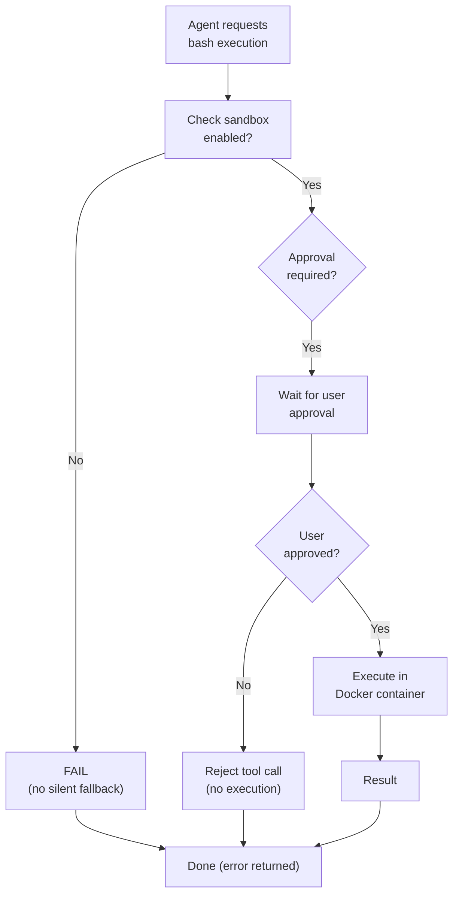
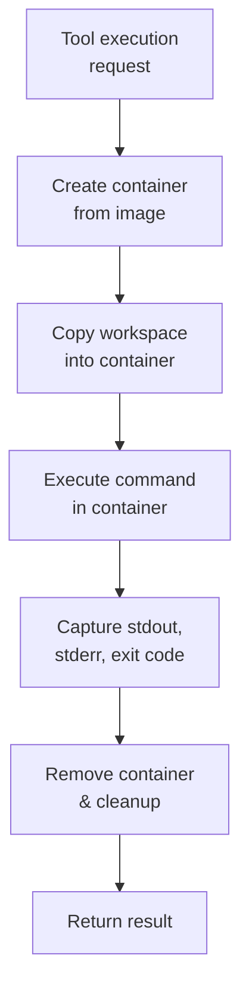
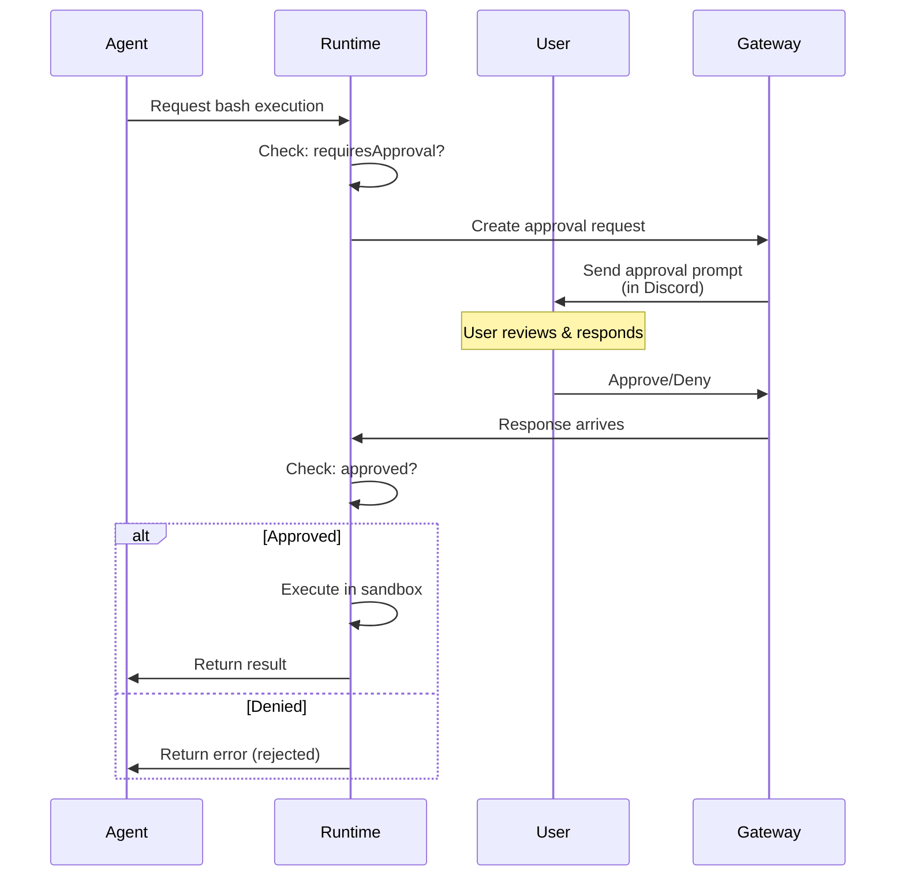

# 08 - Security & Sandbox

DisClaw runs dangerous operations (bash, git, file I/O) in isolated Docker containers with a fail-closed policy: if the sandbox is unavailable, execution fails rather than falling back to the host.

---

## 1. Security Model



---

## 2. Sandbox Architecture

Docker-based execution isolation ensures agent code cannot access host system.

### Container Lifecycle



### Container Configuration

```dockerfile
# Sandbox image (planned: node:18-alpine or similar)
FROM node:18-alpine

WORKDIR /workspace

# Security: drop all capabilities
RUN setcap -r $(which ping)

# Disable network
# (networkMode=none in docker run)

# Readonly root filesystem
# (readOnlyRootfs=true in docker run)
```

### Docker Run Settings

```typescript
interface SandboxConfig {
  image: string;              // e.g., "node:18-alpine"
  networkMode: 'none';        // No network access
  memoryLimit: string;        // e.g., "512m"
  cpuLimit: number;           // e.g., 0.5 (CPU cores)
  timeout: number;            // Max execution time (ms)
  workdir: string;            // e.g., "/workspace"
  readOnlyRootfs: boolean;    // Read-only filesystem
  capDrop: string[];          // Drop Linux capabilities
  securityOpt: string[];      // Security options
}

// Docker run equivalent:
docker run \
  --network none \
  --memory 512m \
  --cpus 0.5 \
  --timeout 30s \
  --rm \
  -v /host/workspace:/workspace \
  node:18-alpine bash -c "command"
```

---

## 3. Approval Workflow

Dangerous operations require explicit user approval.

### Tools Requiring Approval

| Tool | Operations | Why |
|------|-----------|-----|
| `bash` | Any shell command | Can delete files, access sensitive data |
| `git` | push, force-push | Could corrupt repository |
| `file` | write to file | Could modify application logic |

### Approval Gate Flow



### Approval Prompt Example

User sees in Discord:

```
🔐 **Approval Required**

Agent wants to execute bash command:

```bash
git push origin main
```

This requires your explicit approval.

[✅ Approve] [❌ Deny] [❓ Details]
```

---

## 4. Workspace Isolation

All file operations are confined to the workspace directory.

### Workspace Layout

```
~/.disclaw/workspace/
├── temp/                    # Temporary files, auto-cleanup
├── data/                    # Agent-created data
├── uploads/                 # User uploads
├── reports/                 # Generated reports
└── scripts/                 # Agent-managed scripts
```

### Path Validation

```typescript
function validatePath(requestedPath: string): boolean {
  // Resolve to absolute path
  const absolute = path.resolve(workspaceDir, requestedPath);

  // Check: is absolute path within workspace?
  if (!absolute.startsWith(workspaceDir)) {
    return false;  // Reject: would escape workspace
  }

  // Check: not in deny list
  const denyList = [
    workspaceDir + '/...',
    workspaceDir + '/.env',
  ];
  if (denyList.some(p => absolute.startsWith(p))) {
    return false;
  }

  return true;
}
```

### Deny List (Default)

```yaml
sandbox:
  denyPaths:
    - /etc/passwd
    - /etc/shadow
    - /root/.ssh
    - /root/.aws
    - /root/.config
    - /.env
    - /secrets
```

---

## 5. Resource Limits

Prevent resource exhaustion attacks.

### Limits

| Resource | Default | Purpose |
|----------|---------|---------|
| **Memory** | 512 MB | Prevent OOM killer |
| **CPU** | 0.5 cores | Prevent CPU hogging |
| **Timeout** | 30 seconds | Prevent infinite loops |
| **File size** | 10 MB | Prevent disk fill |
| **Process count** | 1 | Single-threaded execution |

### Implementation

```typescript
const container = await docker.createContainer({
  Image: 'node:18-alpine',
  Memory: 512 * 1024 * 1024,              // 512 MB
  MemorySwap: 512 * 1024 * 1024,          // No swap
  CpuPeriod: 100000,
  CpuQuota: 50000,                        // 0.5 cores
  HostConfig: {
    NetworkMode: 'none',
    ReadonlyRootfs: true,
    CapDrop: ['ALL'],
    CapAdd: ['NET_BIND_SERVICE'],
    SecurityOpt: [
      'no-new-privileges:true',
    ],
  },
});

// Start with timeout
setTimeout(() => {
  container.kill();
}, 30000);
```

---

## 6. Network Isolation

Containers have no network access (networkMode=none).

### Implications

- **Bash tool**: Cannot access internet or other hosts
- **Browser tool**: Still works (Puppeteer runs outside sandbox, interacts with web on host)
- **File tool**: Cannot access network filesystems
- **Memory tools**: Still work (read local SQLite)

---

## 7. Filesystem Permissions

Container runs as non-root with restricted permissions.

```dockerfile
FROM node:18-alpine

RUN addgroup -g 1000 app && \
    adduser -u 1000 -G app -s /sbin/nologin -D app

WORKDIR /workspace
RUN chown -R app:app /workspace

USER app

# Cannot write to /root, /etc, /sys, etc.
```

---

## 8. Tool-Specific Security

### Bash Tool

```typescript
interface BashExecution {
  command: string;
  host: 'sandbox' | 'host';  // Force: only 'sandbox' allowed if sandbox required
  timeout: 30000;
  cwd: '/workspace';          // Always in workspace
}

// Validation
if (config.sandbox.required && request.host === 'host') {
  throw new Error('Sandbox required but host requested');
}
```

### Git Tool

```typescript
interface GitOperation {
  action: 'clone' | 'commit' | 'push' | 'pull';
  requiresApproval: {
    'push': true,              // Always requires approval
    'pull': false,
    'commit': false,
    'clone': false,
  };
}

// Sandbox: runs git in container, isolated from host repo
```

### File Tool

```typescript
interface FileOperation {
  action: 'read' | 'write' | 'search';
  path: string;              // Must pass validatePath()
  workspace: true,           // Always confined
}
```

---

## 9. Error Handling & Logging

All security events are logged for audit.

```typescript
interface SecurityEvent {
  timestamp: Date;
  type: 'approval_requested' | 'approval_granted' | 'approval_denied' |
         'sandbox_error' | 'path_validation_failed' | 'resource_limit_exceeded';
  agentId: string;
  userId: string;
  details: {
    tool: string;
    command?: string;
    path?: string;
    reason?: string;
  };
}

// Logged to:
// - Console (with level)
// - File (/var/log/disclaw/security.log)
// - Database (future)
```

### Failure Modes

| Scenario | Behavior | Log Level |
|----------|----------|-----------|
| Sandbox unavailable | Fail immediately, return error | ERROR |
| Resource limit exceeded | Kill container, return timeout error | WARN |
| Path escape attempt | Reject, log security event | WARN |
| Approval denied | Return rejection error | INFO |
| Command execution error | Return exit code + stderr | INFO |

---

## 10. File Reference

**Planned files** (not yet implemented):

| File | Purpose |
|------|---------|
| `packages/sandbox/sandbox-manager.ts` | Create/manage Docker containers |
| `packages/sandbox/container-config.ts` | Container security settings |
| `packages/sandbox/path-validator.ts` | Validate file paths, prevent escape |
| `packages/sandbox/resource-limits.ts` | CPU, memory, timeout enforcement |
| `packages/sandbox/approval-gate.ts` | Approval workflow for dangerous operations |
| `packages/sandbox/error-handler.ts` | Sandbox-specific error handling |
| `packages/sandbox/audit-log.ts` | Security event logging |

---

## 11. Best Practices

### For Users

1. **Review approval requests carefully** — Never auto-approve
2. **Keep sandbox updated** — Patch Docker image regularly
3. **Monitor logs** — Check for unusual activity
4. **Use allowlists** — Restrict guilds/channels/users

### For Developers

1. **Assume sandbox can fail** — Handle SandboxUnavailableError gracefully
2. **Validate paths** — Use provided path validation, never trust user input
3. **Set appropriate timeouts** — Don't allow infinite waits
4. **Log security events** — Make audit trails complete

---

## Cross-References

- [03-agent-runtime.md](./03-agent-runtime.md) — Tool execution in agent loop
- [05-tools-skills-system.md](./05-tools-skills-system.md) — Tool definitions and approval
- [07-configuration.md](./07-configuration.md) — Sandbox configuration
