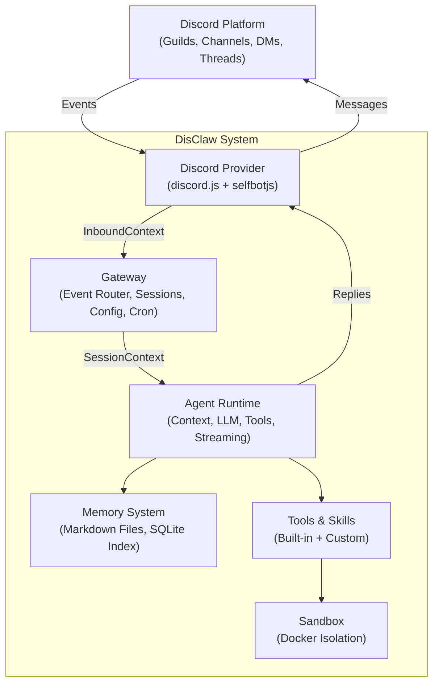

# System Architecture

Comprehensive system-level architecture for DisClaw. For detailed component documentation, see the numbered design documents in `docs/disclaw/`.

---

## 1. High-Level System Architecture



---

## 2. Component Responsibilities

### Discord Provider
- Connects to Discord via discord.js (official Bot API)
- Normalizes Discord events to `InboundContext` (guild, channel, user, content, attachments, etc.)
- Sends replies back to Discord (messages, embeds, threads, reactions)
- Applies allowlists (guild/channel/user filtering)

**Key Files**: `packages/bot/`

**See**: [01-discord-provider.md](./disclaw/01-discord-provider.md)

### Gateway
- Single always-on process — central control plane
- Routes `InboundContext` to sessions by guild/channel/user scope
- Manages session state (conversation history, metadata)
- Loads and broadcasts configuration changes (YAML + hot-reload)
- Executes heartbeat (periodic agent checks)
- Manages cron scheduler (time-based task execution)

**Key Files**: `packages/gateway/`

**See**: [02-gateway.md](./disclaw/02-gateway.md)

### Agent Runtime
- Executes the agent loop: `receive → context → LLM → tools → reply → persist`
- Assembles context from session history, memory, and skills
- Calls configured LLM provider (Anthropic, OpenAI-compatible, etc.)
- Executes tool calls (bash, browser, file, memory, cron, git, canvas)
- Streams responses back to Discord token-by-token
- Persists conversation history and memory updates

**Key Files**: `packages/agent/`

**See**: [03-agent-runtime.md](./disclaw/03-agent-runtime.md)

### Memory System
- All memory stored as Markdown files on filesystem
- Files: `SOUL.md` (personality), `AGENTS.md` (config), `MEMORY.md` (long-term), daily logs
- SQLite vector index for semantic search (`memory_search` tool)
- Memory tools: `memory_search`, `memory_get`
- Async index sync with file watcher debounce

**Key Files**: `packages/memory/`

**See**: [04-memory-system.md](./disclaw/04-memory-system.md)

### Tools & Skills System
- Built-in tools: bash, browser, file, memory_search, memory_get, canvas, cron, git
- Skill system: Markdown files with YAML frontmatter
- Skill precedence: workspace → user → bundled
- Tool registry with approval gates (bash, git require approval)

**Key Files**: `packages/tools/`, `packages/skills/`

**See**: [05-tools-skills-system.md](./disclaw/05-tools-skills-system.md)

### Sandbox
- Docker-based isolated execution for dangerous tools
- Fail-closed: if sandbox unavailable, execution fails (no fallback to host)
- Containers: none network, memory limit, CPU limit, timeout
- Resource limits prevent exhaustion attacks
- Security: read-only filesystem, dropped capabilities, path validation

**Key Files**: `packages/sandbox/`

**See**: [08-security-sandbox.md](./disclaw/08-security-sandbox.md)

---

## 3. Data Flow: Agent Turn

```
1. Discord Event
   ↓ (InboundContext)
2. Gateway Event Router
   ↓ (sessionKey = {agentId}:{scope})
3. Session Manager
   ↓ (load history, queue request)
4. Agent Runtime
   ├─ Load Memory (SOUL.md + AGENTS.md + MEMORY.md + daily logs)
   ├─ Assemble Context (history + memory + skills)
   ├─ LLM Call (Anthropic API)
   ├─ Tool Loop (execute bash, browser, file, etc.)
   ├─ Stream Response (token-by-token to Discord)
   └─ Persist (memory flush + history update)
   ↓
5. Discord Provider
   ├─ Send Reply Messages
   ├─ Update Embeds
   └─ Handle Threads
   ↓
6. Discord Platform
```

---

## 4. Configuration & Startup

### Startup Sequence

```
1. Parse command-line flags + load config (YAML)
2. Overlay environment variables
3. Validate configuration schema
4. Start file watcher for hot-reload
5. Initialize memory system (load SOUL.md, AGENTS.md, sync vector index)
6. Load skills from workspace + user directories
7. Create tool registry (built-in tools + skills)
8. Create sandbox manager (Docker configuration)
9. Create & wire tool handlers (memory, file, bash, git, browser, web_search, web_fetch, cron)
10. Initialize Discord provider (discord.js client)
11. Create session manager + persistence layer
12. Wire agent loop to gateway dispatch (with approval gate)
13. Start heartbeat timer (30 min interval)
14. Start cron scheduler (run loop every 1s)
15. Listen for Discord events
```

### Configuration File

Single `disclaw.config.yaml` with sections:

- **provider**: Discord bot token, intents, allowlist
- **agent**: LLM provider, model, context window
- **gateway**: Port, host, heartbeat interval
- **sandbox**: Docker settings, resource limits
- **tools**: Enable/disable tools, approval requirements
- **skills**: Skill paths, auto-reload
- **logging**: Level, format, retention

**See**: [07-configuration.md](./disclaw/07-configuration.md)

---

## 5. Session Management

### Session Key Hierarchy

```
Most specific → Least specific

1. guild:channel:user   → {agentId}:guild:{guildId}:channel:{channelId}:user:{userId}
2. guild:channel        → {agentId}:guild:{guildId}:channel:{channelId}
3. guild:user (DM)      → {agentId}:guild:{guildId}:user:{userId}
4. guild                → {agentId}:guild:{guildId}
5. user (DM)            → {agentId}:user:{userId}
```

### Session State

Each session maintains:

- Conversation history (all messages in this session)
- Metadata (created, last message, guild/channel/user IDs)
- Active status (for queue management)

Sessions persist to disk for resumption after restart.

---

## 6. Memory Layers

### Load Order (Context Assembly)

```
1. SOUL.md               Always (immutable personality)
2. AGENTS.md            Always (agent configuration)
3. MEMORY.md            Main session only (long-term, can be updated)
4. Today's daily log    All sessions (today's context)
5. Yesterday's log      All sessions (recent context)
```

### Vector Index

- SQLite-based embedding store at `~/.disclaw/memory/{agentId}.sqlite`
- Chunks indexed by filename, line range, and vector embedding
- File watcher detects changes, marks index dirty (debounce 1.5s)
- Lazy sync on first `memory_search` call or interval

---

## 7. Tool Execution Model

```
Tool Call
  ↓
Check: Approval Required?
  ├─ No → Execute immediately
  └─ Yes → Create approval gate
           Send Discord approval message with Approve/Deny buttons
           Wait for user interaction (timeout: 60s default)
           Approved? → Execute : Reject (fail-closed)
  ↓
Route by Tool Type
  ├─ bash → Docker sandbox
  ├─ browser → Puppeteer/Playwright
  ├─ file → Local workspace (validated path)
  ├─ memory_search → SQLite index search
  ├─ memory_get → Direct file read
  ├─ memory_write → Append to MEMORY.md
  ├─ cron → Job persistence
  ├─ git → Git commands (sandbox)
  ├─ web_search → Brave Search API
  └─ web_fetch → Content extraction with Readability
  ↓
Sandbox (for bash, git)
  ├─ Create container from image
  ├─ Apply resource limits (CPU, memory, timeout)
  ├─ Mount workspace volume
  ├─ Execute command
  ├─ Capture output
  └─ Remove container
  ↓
Tool Result
  ├─ Success: {exitCode, stdout, stderr}
  └─ Error: SandboxError, ToolError, or similar
```

### Approval Gate Implementation

Approval requests are sent as Discord messages with interactive buttons (Components API):

- **Provider Interface**: `sendApprovalRequest(channelId, content, userId, timeoutMs)` → Promise<boolean>
- **Gateway Module**: `requestApproval(toolCall, options)` formats tool preview and manages button interaction
- **fail-closed**: If user denies or timeout expires, tool execution is rejected
- **Tools Requiring Approval**: bash, git (push/force-push)

---

## 8. LLM Integration

### Provider Interface

```typescript
interface LLMProvider {
  chat(request: ChatRequest): Promise<ChatResponse>;
  chatStream(request: ChatRequest): AsyncIterator<StreamChunk>;
  name(): string;
  defaultModel(): string;
}
```

### Supported Providers

- **Anthropic**: Native HTTP + SSE streaming (primary)
- **OpenAI-compatible**: Generic `/chat/completions` (OpenAI, Gemini, DeepSeek, etc.)

### Request Flow

```
1. Agent assembles context
2. Calls provider.chatStream(context)
3. Provider calls LLM API with retry logic
4. Streams tokens back as SSE events
5. Runtime accumulates and streams to Discord
6. Tool calls routed to tool executor
7. Tool results sent back to LLM
8. Loop continues until done or max turns
```

---

## 9. Scheduling & Automation

### Heartbeat

- Periodic check at configurable interval (default: 30 min)
- Runs as agent turn in main session
- Reads `HEARTBEAT.md` to decide what to check
- Isolated session: can access memory but separate from user messages

### Cron Jobs

- Three schedule types: `at` (one-time), `every` (interval), `cron` (expression)
- Run loop checks every 1 second for due jobs
- Automatic retry with exponential backoff (max 3 attempts)
- Run logging to disk for audit trail
- Isolated sessions to prevent memory interference

**See**: [06-scheduling-cron.md](./disclaw/06-scheduling-cron.md)

---

## 10. Security Model

### Fail-Closed Sandbox

- Tools can request sandbox execution
- If sandbox unavailable and required, execution **fails** (no fallback)
- Prevents silent degradation that could expose host

### Path Validation

- All file operations confined to workspace directory
- Path validation prevents escape attempts (no symlink traversal)
- Deny list for sensitive paths

### Approval Workflows

- **Bash and git push/force-push** require user approval before execution
- **Approval Gate**: Sends Discord message with Approve/Deny buttons (Components API)
- **Timeout**: 60 seconds default (configurable), request expires and is rejected
- **User Interaction**: Button clicks handled via Discord interaction webhooks
- **Fail-Closed**: Tool execution rejects if timeout expires or user denies
- **Logging**: All approval requests and decisions logged for audit trail
- **Provider Interface**: `Provider.sendApprovalRequest()` method handles button setup and result collection

### Resource Isolation

- Docker containers: 512MB RAM, 0.5 CPU cores, 30s timeout
- Prevents resource exhaustion or infinite loops
- Network: none (isolated from network)
- Filesystem: read-only root (except workspace mount)

**See**: [08-security-sandbox.md](./disclaw/08-security-sandbox.md)

---

## 11. Error Handling & Retry

### Retryable Errors

| Condition | Retry? | Example |
|-----------|--------|---------|
| Network error | Yes | Connection timeout, ECONNRESET |
| HTTP 429 | Yes | Rate limited (respects Retry-After) |
| HTTP 5xx | Yes | Server error (500, 502, 503, 504) |
| HTTP 4xx | No | Client error (400, 401, 403) |

### Backoff Strategy

- Exponential backoff: `delay = min(base × 2^(attempt-1), max)`
- Jitter: ±10-25% random variation
- Max delay: 30 seconds
- Context cancellation: return immediately on cancellation

---

## 12. Deployment Architecture

### Self-Hosted Single Instance

```
User's Server
├─ Node.js Process
│  ├─ Discord Provider (discord.js client)
│  ├─ Gateway (WebSocket server)
│  ├─ Agent Runtime
│  ├─ Memory System
│  └─ Tool Executors
├─ Docker Daemon
│  └─ Sandbox containers (ephemeral)
├─ Filesystem
│  ├─ ~/.disclaw/disclaw.config.yaml
│  ├─ ~/.disclaw/agents/{agentId}/
│  │  ├─ SOUL.md
│  │  ├─ AGENTS.md
│  │  ├─ MEMORY.md
│  │  ├─ HEARTBEAT.md
│  │  └─ memory/
│  ├─ ~/.disclaw/workspace/
│  └─ ~/.disclaw/memory/{agentId}.sqlite
└─ Network
   ├─ Outbound: Discord API (gateway.discord.gg, api.discord.com)
   └─ Outbound: LLM Providers (api.anthropic.com, api.openai.com, etc.)
```

### Scaling Strategy

**MVP**: Single instance per guild or deployment

**Future**:
- Horizontal: Multiple instances, one per guild
- Session state shared via database
- Cron jobs with distributed lock

---

## 13. File Organization

```
packages/
├── types/               # Shared types
├── config/              # Config loading & hot-reload
├── bot/                 # Discord provider
├── gateway/             # Central control plane
├── agent/               # Agent runtime
├── memory/              # Memory system
├── tools/               # Built-in tools
├── skills/              # Skill system
├── sandbox/             # Docker isolation
└── eslint-config/       # Shared linting config
```

---

## 14. Key Design Decisions

| Decision | Rationale |
|----------|-----------|
| **Single gateway process** | Centralized state management, simpler routing |
| **Markdown memory** | Human-editable, transparent, version-controllable |
| **Fail-closed sandbox** | Security over convenience; explicit about limitations |
| **Streaming LLM responses** | Perceived speed; user feedback before completion |
| **Session-based isolation** | Parallel cron/heartbeat without cross-contamination |
| **YAML config + hot-reload** | Simple format, easy hot-reload without restart |
| **Discord.js only (MVP)** | Simpler than multi-channel, deeper Discord integration |
| **Skill system** | Extensibility without code changes or deployment |

---

## 15. Documentation Organization

See `docs/` directory:

| Document | Purpose |
|----------|---------|
| [project-overview-pdr.md](./project-overview-pdr.md) | Project vision, requirements, success metrics |
| [codebase-summary.md](./codebase-summary.md) | Monorepo structure, current state, planned packages |
| [code-standards.md](./code-standards.md) | Development standards, naming, testing, linting |
| [system-architecture.md](./system-architecture.md) | This file — system-level overview |
| [disclaw/00-*.md](./disclaw/) | Detailed design documents (8 numbered docs) |

---

## 16. Testing Infrastructure

### Test Framework & Coverage

- **Framework**: Vitest with workspace configuration (`vitest.workspace.ts`)
- **Coverage Target**: >80% code coverage via Istanbul provider
- **Test Suites**: 11 test files across packages (61 total tests)
- **Coverage Report**: Text + LCOV formats

### Test Organization

| Package | Tests | Focus |
|---------|-------|-------|
| @disclaw/config | 1 suite | Config loading, schema validation, hot-reload |
| @disclaw/gateway | 3 suites | EventRouter, SessionManager, ApprovalGate |
| @disclaw/agent | 1 suite | ToolExecutor |
| @disclaw/memory | 1 suite | VectorIndexer |
| @disclaw/tools | 3 suites | BashHandler, GitHandler, FileHandler, ToolRegistry |
| @disclaw/sandbox | 1 suite | PathValidator |

### Test Commands

```bash
# Run all tests
yarn test

# Run tests with coverage report
yarn test:coverage

# Run tests in watch mode
yarn test --watch
```

---

## 17. CI/CD Pipeline

### GitHub Actions Workflow

File: `.github/workflows/ci.yml`

**Triggers**: Push to main, pull requests to main

**Jobs**:
1. **Build**: Compile TypeScript to JavaScript via `yarn build`
2. **Lint**: ESLint via `yarn lint`
3. **Type Check**: TypeScript strict mode via `yarn check-types`
4. **Test**: Vitest via `yarn test`
5. **Coverage**: Coverage report via `yarn test:coverage` (PRs only)

**Environment**:
- Node.js v20
- Corepack enabled for Yarn package manager
- Cached dependencies for faster builds

---

## 19. Next Steps

Implementation roadmap:

1. **Phase 1 (MVP)**: Core components (provider, gateway, agent, memory, tools, sandbox) — **IN PROGRESS**
2. **Phase 2 (Polish)**: Skills, multi-provider LLM, optimization
3. **Phase 3 (Advanced)**: Multi-agent teams, selfbotjs, web dashboard

---

## Cross-References

- [project-overview-pdr.md](./project-overview-pdr.md) — Project scope
- [codebase-summary.md](./codebase-summary.md) — Monorepo layout
- [code-standards.md](./code-standards.md) — Development standards
- [disclaw/](./disclaw/) — Detailed design documents (00-08)
